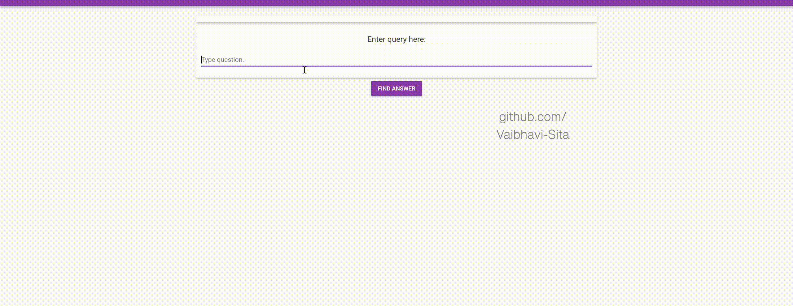

Do you have an exam tomorrow? Gotta revise a topic real quick?
This AI-based application is designed to meet the needs of students who aim for a quick revision of their subjects.

This Artificial Intelligence based application can be trained to answer the questions that you ask based on the documents that you feed. And the best part is, the documents can be of any format! - .docx, .pdf or .txt

## **Techstack** **- Purely Python!**

**Frontend**

Thanks to Anvil framework, that has made the development and deployment of this application quicker and bug-free. I have used a simple User-Interface where the student can input a query into the textbox and retrieve the answer by clicking the "Find Answer" button.

**Backend**

The Jupyter/Colab notebook acts as a server when run. The code focuses on

 1. Connecting to Anvil Server
 2. Configuring ElasticSearch Document Store as database
 3. Utilizing Haystack framework for configuring
	 * Retriever (BM25Retriever)
	 * Reader (deepset/roberta-base-squad2)
4. Pipeline to predict answers for queries

## **Deployed Application**
Head over to https://studyaid.anvil.app to use the demo application

(it has been trained to answer a few basic questions related to cloud computing)
